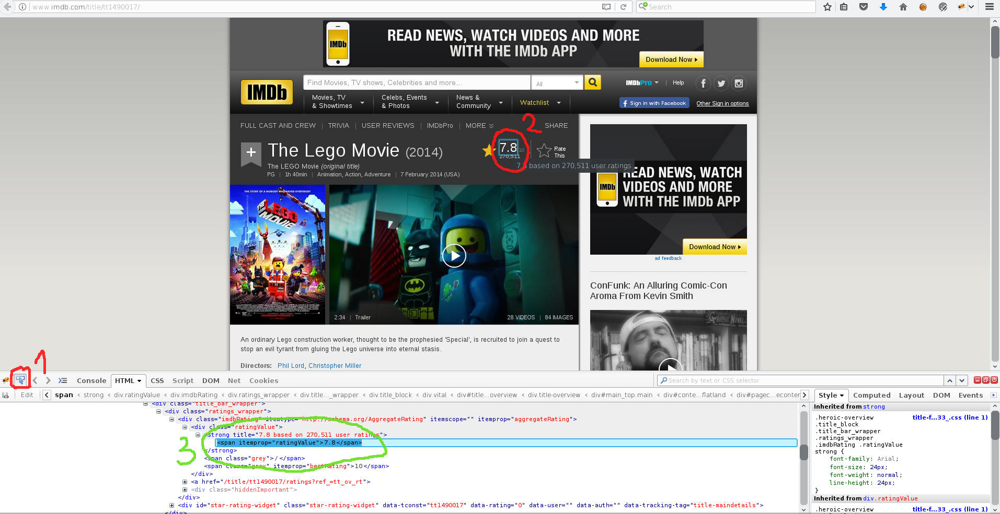
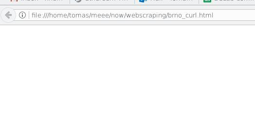
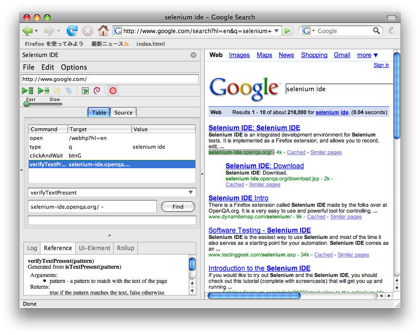
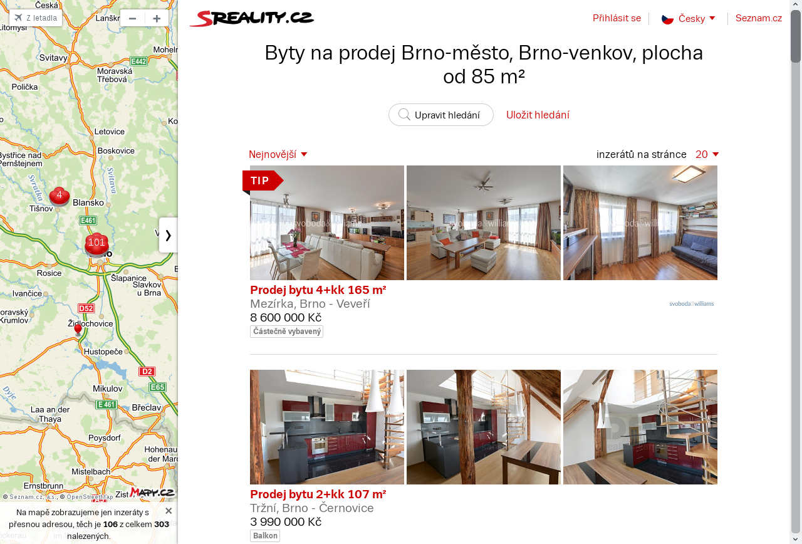
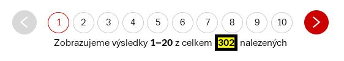

## Introduction
Data scientists are working with data all the time. The most often the data are provided by task owner/project manager. Those data 
are crucial. However, sometimes the data doesn't exist (are not generated), or would be great to enrich the existing data with some additional features
-- e.g. weather, social network comments, forums etc. Internet is one of the best/biggest data sources for many areas - social media research, various
online marketing campaigns or climate data.

In this notebook we will show how to get/scrape data from the Internet. We will demonstrate that it is relatively easy to get data also from complex
web-pages with JavaScript, sessions and other modern web-programming elements.

## Web scraping
The process of getting data from a web is called [Web scraping](https://en.wikipedia.org/wiki/Web_scraping). Scraping a web page, involves fetching 
it and extracting data from it. There are many ways and tools how to do it. In this notebook we will work with R since R is routinely used by many 
data scientist. 

We will show how to scrape data technically, however we need to be aware of [law aspect]((https://en.wikipedia.org/wiki/Web_scraping#Legal_issues)) 
as well. Some companies do not want to process their pages by robots. The law is not complete and it varies country by country and it is still 
evolving.


### Simple approach -- mainly static context
Let's do the web scraping with [rvest](https://cran.r-project.org/web/packages/rvest) package. First, we need to find/localize what 
data we are interested in. We need to know [*XPath*](https://www.w3schools.com/xml/xpath_intro.asp) 
or some other form of the location within the web page. 
For this, we can use [Firebug](http://getfirebug.com/) plugin (there are many similar tools).

Let's say we want to get information about a score in film from [IMDB](http://www.imdb.com). We pick one particular movie, e.g. 
[The Lego Movie](http://www.imdb.com/title/tt1490017/), open it in Firefox and activate the Firebug plugin.




Click on the element inspector (number 1 in the picture above), find the element with the score and click on it (number 2), Firebug will emphasize 
the element in the page source code (number 3). We can get/copy the exact XPath/CSS/html by clicking the right button on the element. In our case it is:

* XPath: `/html/body/div[1]/div/div[4]/div[5]/div[1]/div/div/div[2]/div[2]/div/div[1]/div[1]/div[1]/strong/span`
* HTML: `<span itemprop="ratingValue">7.8</span>`

In general, it is better not to work with the exact path from the root `/html`, since even a slight change in the code would
break our scraping (path will become invalid). Therefore we will work with a simpler path.
From the source code, we can see that one element above our `<span>` is `stronger`.  Let's stick with `<stronger><span>` for now. 

Open R Studio and start the scraping! Load libraries


```{r results='hide'}
library(tidyverse)
library(rvest)
```

Try to get the score
```{r}
lego_url <- "http://www.imdb.com/title/tt1490017/"

rating <- read_html(lego_url) %>% 
  #search for elements <strong> <span>
  html_nodes("strong span") %>%
  #take a text string from span element
  html_text() %>%
  #convert to number
  as.numeric()

rating
```

With some 5 lines of R code we got the score for *The Lego Movie*. Now it should be easy to run this code against any set of movies on [IMDB](http://www.imdb.com)

This is a good approach for getting mainly static data (e.g. Wikipedia pages), however it is not
possible to use for getting dynamic context (like social media that use logins and complex JavaScript). 


### Scraping complex dynamic pages

_let's find a mean price for bigger flats in Brno and its countryside:
_[sreality.cz](https://www.sreality.cz/hledani/prodej/byty/brno,brno-venkov?plocha-od=85&plocha-do=10000000000)_.
First, we need to found out a number of properties at the bottom of the page


With Firebug, we find out - we need XPath: `//div[23]/p/span[2]"` (why this string?)

```{r}
properties <- read_html("https://www.sreality.cz/hledani/prodej/byty/brno,brno-venkov?plocha-od=85&plocha-do=10000000000") %>% 
  html_nodes(xpath = '//div[23]/p/span[2]')
```
That should be it, however if we take a look on results - it is empty
```{r}
length(properties)
```


In our web-browser there is 20 pages of results...

The answer is simple but definitely not obvious. `rvest` uses `curl` for browsing/downloading web pages. `curl` is a great command line 
tool but definitely not good fit for JavaScript. If we check what exactly `curl` got:
```{bash}
curl "https://www.sreality.cz/hledani/prodej/byty/brno,brno-venkov?plocha-od=85&plocha-do=10000000000" > brno_curl.html
```

Open `brno_curl.html` in a browser...



It is somehow different!

Therefore we need something that emulates a proper browser. There are great tools: [PhantomJs](http://phantomjs.org/) -- PhantomJS is a 
headless WebKit scriptable with a JavaScript API. [Selenium](https://en.wikipedia.org/wiki/Selenium_(software)) -- enables web browser automation. 
It can work via IDE:


or a driver.
 
These SW are nice but we would need to speak 2 extra languages: Java and JavaScript. Fortunately, there is R wrapper 
[RSelenium](https://cran.r-project.org/web/packages/RSelenium). A good introduction to the package can be found in the package [vignettes](https://cran.r-project.org/web/packages/RSelenium/vignettes/), or 
[webinars](https://cran.r-project.org/web/packages/RSelenium/vignettes/OCRUG-webinar.html)


Now, let's go back to our task

```{r results='hide'}
library(tidyverse)
library(RSelenium)
```


Initialize our session (browser).
```{r}
rD <- rsDriver(port=4444L, browser = "firefox")
remDr <- rD$client
```

and open the page

```{r}
remDr$navigate("https://www.sreality.cz/hledani/prodej/byty/brno,brno-venkov?plocha-od=85&plocha-do=10000000000")
```
 
we can play with it in many ways (get exact window/item position, screenshot, etc.)
For example, get a screenshot
```{r}
remDr$screenshot(display = TRUE)

```




We can see that the page is correct now - it contains all the info we need (number of properties, etc).
Let's find the number via FireBug. Once we have the path, we can validate it via _RSelenium_ (show the element with yellow background for 
5 seconds)
```{r}
found <- remDr$findElement(using = "xpath",value='//div[23]/p/span[2]')
found$highlightElement(wait = 5)
```



Great! It is working. Now get the number
```{r}
elem <- remDr$findElement(using="xpath",value='//div[23]/p/span[2]')$getElementText()
flats_found <- as.integer(elem[[1]])
flats_found
```


Similarly, check the number of pages. Please notice, we are using _findElement**s**_ instead if _findElement_!
```{r}
library(stringr)
elem <- remDr$findElements(using="xpath",value='//ul[@class="paging-full"]')
elemstr <- elem[[1]]$getElementText()[[1]]
elems <- as.numeric(str_split(elemstr," ")[[1]])

(pages_showed <- max(elems) )

```

```{r}

pages <- ifelse(flats_found %% 20 >0, flats_found%/%20+1, flats_found/20)

pages
```

Why got I 10 in `pages_showed` and 15 in `pages`?


```{r}
ads <- remDr$findElements(using = "css", value='div[class="property ng-scope"]')
texts <- sapply(ads,function(x){x$getElementText()[[1]]})
texts[2]


#from each property extract URL from <a/> subelement
urls_tmp <- sapply(ads,function(x){x$findChildElement(using = "css",value = 'a[class=title]')})
urls <- sapply(urls_tmp,function(x){x$getElementAttribute(attrName = "href")[[1]]})
urls[1]
```


Get square meters for for each ad
```{r}
str_match(texts[[1]],"([\\d ]+) m²")[[2]]
```

```{r}
#apply str_match for each element in texts
sqm <- sapply(texts,function(x){str_match(x, " ([\\d ]+) m²")[[2]]},USE.NAMES = FALSE)

```

Get price
```{r}
prices <- sapply(texts,function(x){str_match(x, "\\n([\\d ]+) Kč\\n")[[2]]}, USE.NAMES = FALSE)
```

We have all the information about flats -- price, area and link for each ad on the page. Let's store these info
into new tibble
```{r}
flats <- tibble(url = character(), price = character(), sqm = character(), text = character())
flats <-flats %>%  add_row(url = urls, price=prices, sqm = sqm, text = texts)
flats
```


As a final step we need to make a loop to process every page.


```{r}
flats <- tibble(url = character(), price = character(), sqm = character(), text = character())

for(page in 1:pages){
  print(paste("page:",page))
  
  #load page (1st page is already loaded - skip it)
  if(page!=1){
    url_page=paste0("https://www.sreality.cz/hledani/prodej/byty/brno,brno-venkov?plocha-od=85&plocha-do=10000000000&strana=",page)
    remDr$navigate(url_page)
  }
  print("Loaded")

  #texts
  ads <- remDr$findElements(using = "css", value='div[class="property ng-scope"]')
  texts <- sapply(ads,function(x){x$getElementText()[[1]]})
  cat("\t texts=",length(texts))

  #links
  urls_tmp <- sapply(ads,function(x){x$findChildElement(using = "css",value = 'a[class=title]')})
  urls <- sapply(urls_tmp,function(x){x$getElementAttribute(attrName = "href")[[1]]})
  cat("\t urls=",length(urls))
  
  #sqm
  sqms <- sapply(texts,function(x){str_match(x, " ([\\d ]+) m²")[[2]]},USE.NAMES = FALSE)
  cat("\t sqms=",length(sqms))
  
  #prices
  prices <- sapply(texts,function(x){str_match(x, "\\n([\\d ]+) Kč\\n")[[2]]}, USE.NAMES = FALSE)
  cat("\t prices=",length(prices))

  #add results to flats tibble
  flats <-flats %>% add_row(url = urls, price=prices, sqm = sqms, text = texts)
  print(" .... OK")
}
```


Double check the results
```{r}
dim(flats)
```

And check the first few lines
```{r}
head(flats)
```


```{r}
flats %>% count(url, sort = TRUE) %>% head()
```


```{r}
flats %>% filter(url=="https://www.sreality.cz/detail/prodej/byt/5+1/brno--/2091725148") %>% select(text)
```


```{r}
flats %>% filter(url=="https://www.sreality.cz/detail/prodej/byt/2+kk/brno--mlynska/2366361948")%>% select(text)
```


```{r}
flats <- flats %>% group_by(url) %>% summarise(price=first(price),text=first(text),sqm=first(sqm))

dim(flats)
```


## What next?
Standard feature engineering:

- make _price_ column consistent
- what other data/information we might need for our analysis

By solving these questions, we create a valid data source for further analysis.


### For example: average price for bigger Brno's flats


Convert square meters into numeric
```{r}
flats$sqmn <- as.numeric(flats$sqm)
flats$sqmn
```


format price into proper shape (remove empty spaces, convert to integers)
```{r}
flats$pricen <- as.numeric(str_replace_all(flats$price,pattern = "\\s+",""))
flats$pricen
```


The mean price is
```{r}
mean(flats$pricen, na.rm = TRUE)
```

The mean price for 1 square meter (2017-08-03)
```{r}
mean(flats$pricen, na.rm = TRUE)/mean(flats$sqmn, na.rm = TRUE)
```


